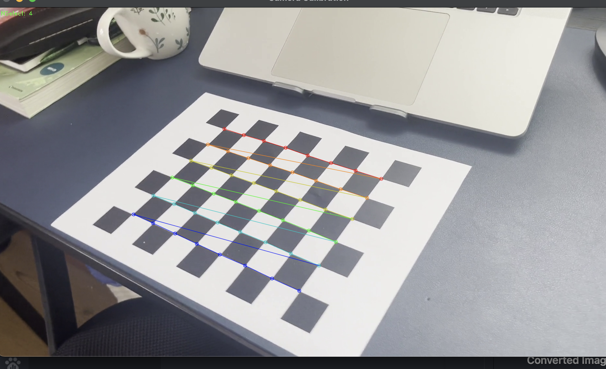
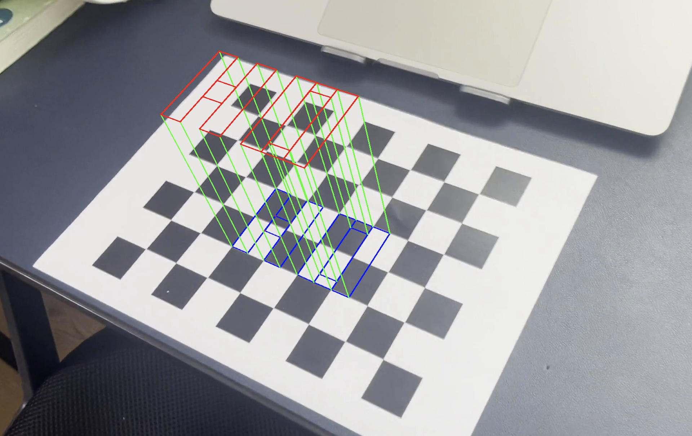

# Calibri - Camera Calibration Example


## Calibration Result

```python
    ## Camera Calibration Results
    * The number of selected images = 13
    * RMS error = 1.22593131458713
    * Camera matrix (K) =
    [[1.73411843e+03 0.00000000e+00 9.41401794e+02]
    [0.00000000e+00 1.72423562e+03 5.00515230e+02]
    [0.00000000e+00 0.00000000e+00 1.00000000e+00]]
    * Distortion coefficient (k1, k2, p1, p2, k3, ...) = [ 1.02879028e-01  6.42472730e-01  5.65504920e-03 -6.81325775e-03
    -6.92866558e+00]
```

## Results of Camera Calibration and AR

### Captured Images 

- Here, the word "HO" is a just random word choosen to be displayed in the AR.

|           Camera Calibration            |       Displayed HO word in AR        |
| :-------------------------------------: | :----------------------------------: |
|  |  |

### Video Results 


https://user-images.githubusercontent.com/65296404/235365020-e4a8c1fd-9893-4ddd-b013-7c4a2105b584.mov

